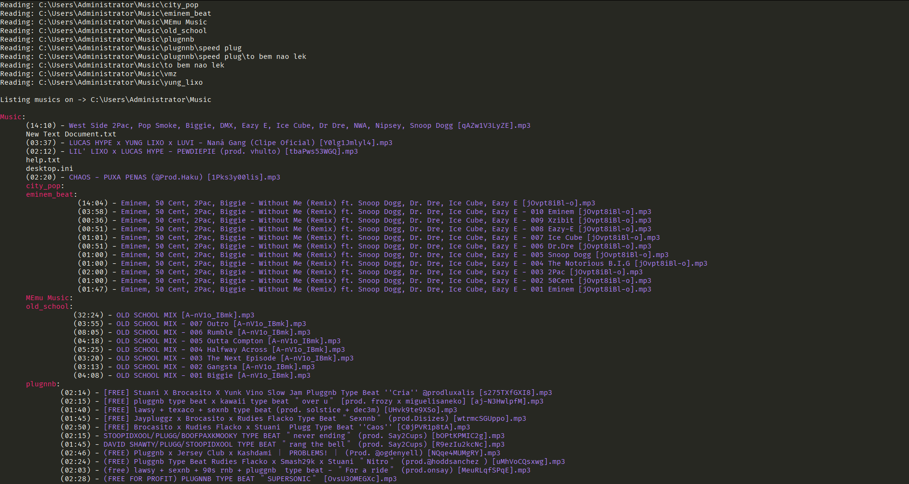

# Audio File seeker in Rust
This is a CLI program that allows you to view all audio files in a directory and its subdirectories.

### Preview

### How to use
#### Using cargo: 
`cargo run - <musics_folder_path>`
#### Using binary:
`music_seeker.exe <musics_folder_path>`

## Dependencies
- [lofty](https://crates.io/crates/lofty) - Audio metadata library
- [filepath](https://crates.io/crates/filepath) - Get the filesystem path of a file.
- [colored](https://crates.io/crates/colored) - Add colors to console output